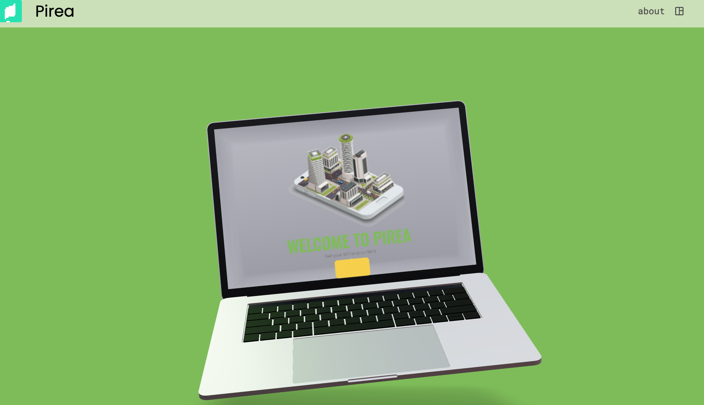

### Han Jiung (tetgo)

##### now, CodeStates BlockChain (2021.11 ~ 2022.04)


#### Why are tetgo a developer?

```
I am having fun with computer related work.

why? just fun

It is not a light feeling. I am responsible for what I do.
```

##### 

***


#### my past table of contents


[1. Education](# Education)

[2. Training Course](# Training Course)

[3. Awards](# Awards)

[4.Certificate](# Certificate )

[5. Project](# Project)

[6. Freelancer](# Freelancer)


***


### Education


-  Future education center CHUNG-ANG UNIVERSITY 
  - Computer Engineering BS (2019.02 ~ 2021.02)
  - Credit 4.36 / 4.5
  - 졸업
  
  
  
- K-Shield Jr. 6기
  - computer emergency response team course (2021.03 ~ 2021. 06)
  
    >  Ref, http://kshieldjr.org/tlnt_mu01_002.do
  
  - 수료


- codestates beb 02기

  - blockchain couse (2021. 08 ~ 2022. 04)

    > Ref, https://codestates.com/course/blockchain?gclid=CjwKCAjw9LSSBhBsEiwAKtf0n4D5ZYWt762pafhjdZbMOucAs1GQJT4JE6gag0lfMIrOZkrDLjpyuBoCiIMQAvD_BwE


***


### Training Course

- National Information Society Agency(NIA), Data Creator Camp (2020.09.26)

- AI Yangjae Hub, Embedded deep learning process using JETSON TX2 (2020.09.02 ~ 04)

- Korea Computing Industry Association(K-CIA), Pytorch - Artificial Neural Network Deep Learning Model Development (2020.08.26 ~ 28)

- National IT Promotion Agency(nipa), Utilize AI Technology (2020.07 ~ 08 )

- Game User Protection Center(GUCC), Blockchain LV.99 (2020.01.17~23)


***


### Awards

- Jeju MBC Marathon 20th Division 42.195km 1st place

- Jeju TourismMarathon 20th Division 10km 3st place

- red cross blood donation, (silver, gold)

- Game User Protection Center, Blockchain Manrap Competition
  >  ref
  >
  > 1. https://www.mk.co.kr/news/it/view/2020/02/142651/
  > 2. http://gamefocus.co.kr/detail.php?number=102149
  
  

***


### Certificate

- Document	
  - Microsoft Office Specialist 2007 Master
  - KCCI LICENSE (Computer User in the field of Spreadsheet & Database Level - 1)

- job performance
  - ICQA LICENSE (Network Manager Level 2)
  - KDFS LICENSE (digital forensic Level 2, just written test )
  - HRDK LICENSE (Engineer Information Processing, just written test)


***


### Project

 

1. cls-Color-List-Show

   - My main language of project

      

   - [source link](https://github.com/tetgo/cls)


> You can divide files and folders with the cls command.


2. ToyProject

   - My main language of this project

     

   - [source link](https://github.com/tetgo/ToyProject)


> 1. clickgame, image detect
> 2. Coin price view, macos header


3. DocuFree

   - My main language of this project

     

   - [source link](https://github.com/rjursi/DocuFree)

   - [GUI](https://github.com/tetgo/GUI)


> document malware detection
>
> Work created with a graphic interface related to malicious code


4. wm (wallet maker)

   - My main language of this project

     

   - [source link](https://github.com/tetgo/wm)

   - [introduce](https://wooong.dev/38)


> Command lIne project, wallet maker with html , rest, just


5. Blockchain (pixel Korea - pirea)

   - my main languge of this project

     

   - [source link](https://github.com/codestates/BEB_02_pirea)


   - [video player](https://drive.google.com/file/d/1-8TBhvpNMflwMd7jhKCoID51mSIfuWb9/view?usp=sharing)


   - Image





6. Calculate (CECOM-CAU)

   - My main language of this project

      

   - [source link](https://github.com/CECOM-CAU/CECOME_CALCULATE.git)

> Calculator over 2.1 billion


***


### Freelancer 

- My main language of main language

  

- 2021.06 ~

  - 3 건 (python, google apps script)

  > [ref](https://soomgo.com/profile/users/5006849?from=my_info_preview), I wrote a program that makes work on a computer very simple


***


### blockChain node validator run

- 2022.04.01 ~


***


#### contact

jiungdev@gmail.com


[Home](https://tetgo.github.io/) 으로 돌아가는 링크 입니다.

